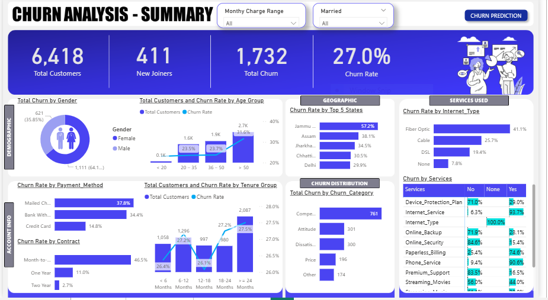
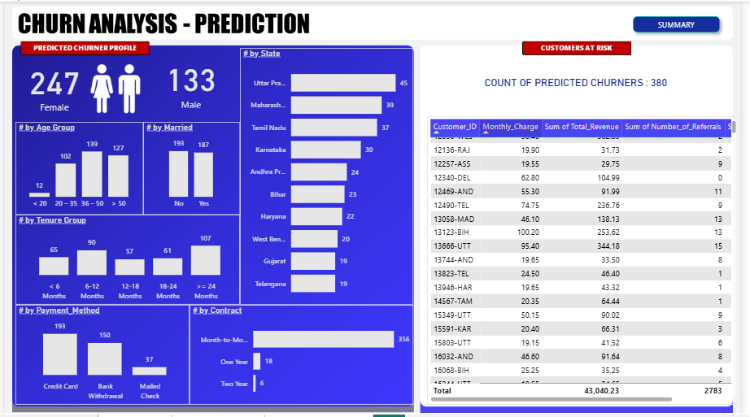
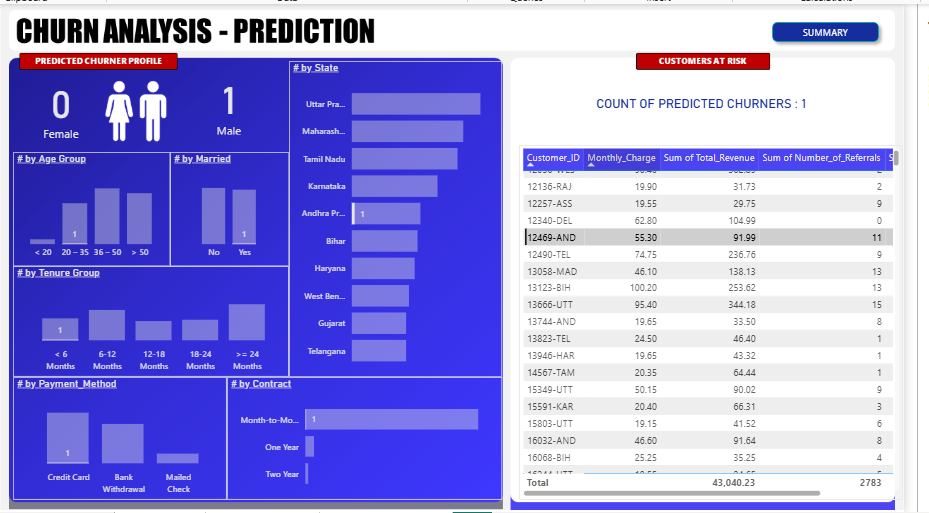

# Churn-Analysis
# 🔁 Customer Churn Analysis & Prediction Dashboard

This project provides an end-to-end solution for **analyzing and predicting customer churn** using SQL, Power BI, and Python. It includes demographic, geographic, account, and service-based visual analysis, as well as a machine learning model to predict future churners.

---

## 🎯 Objectives

- Visualize and analyze customer data across:
  - **Demographic**, **Geographic**, **Account**, **Payment**, and **Service** features.
- Study churner profiles and identify actionable insights for **retention**.
- Predict potential future churners using **Random Forest** classifier.
- Enable business teams to **target marketing campaigns** more precisely.

---

## 🔍 Project Highlights

- **ETL & Data Cleaning** done using **SQL Server**.
- Dashboards built in **Power BI** with interactive:
  - **Drill-throughs** by churn reason.
  - **Buttons** for page navigation.
  - **Slicers** by monthly charge range and marital status.
- **Machine Learning Model**:
  - Built using **Python (Jupyter Notebook)**.
  - Feature selection, train-test split, model evaluation (accuracy, confusion matrix).
  - Algorithm: **Random Forest Classifier**.

---

## 📊 Dashboard Previews

### 🔹 Churn Overview

### 🔹 Churn Prediction

### 🔹 Slicer and Navigation Enhancements

---

## 🧠 ML Model Summary

- Features used: tenure, monthly charges, internet service, contract type, etc.
- **Train-Test Split:** 84/16
- **Accuracy Achieved:** 84%
- **Libraries Used:** `pandas`, `sklearn`, `matplotlib`, `seaborn`

---

## 🛠️ Tools & Technologies

- **SQL Server** – Data cleaning and transformation
- **Power BI** – Data visualization and business insights
- **Python (Jupyter)** – Machine learning model development
- **Random Forest** – For binary classification (Churn/No-Churn)

---

## 🚀 Future Enhancements

- Deploy the ML model via a web app using **Streamlit** or **Flask**.
- Set up an **automated data pipeline** for weekly churn predictions.
- Track **model drift** and re-train regularly with new data.
- Introduce **email/marketing automation suggestions** from predictions.

---

## 🙋‍♀️ Author

**Michelle Warari**  
_Data Analyst | Power BI | SQL | Python | Machine Learning_  
Check out my portfolio: [GitHub/michellewarari](https://github.com/michellewarari)

---

## 📫 Let’s Connect
- **Email:** wararimitchell@gmail.com  
- Available for internships, freelance projects, or collaborations.

